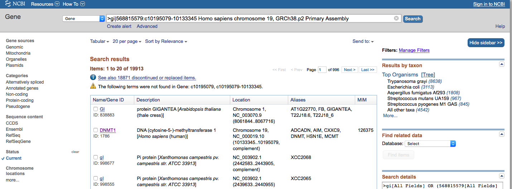
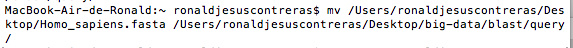
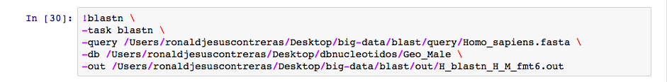
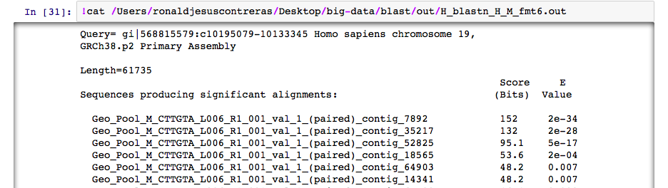
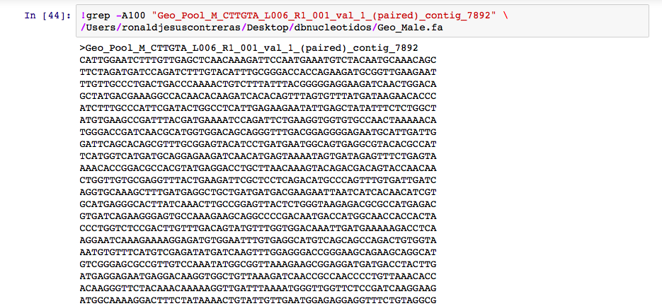
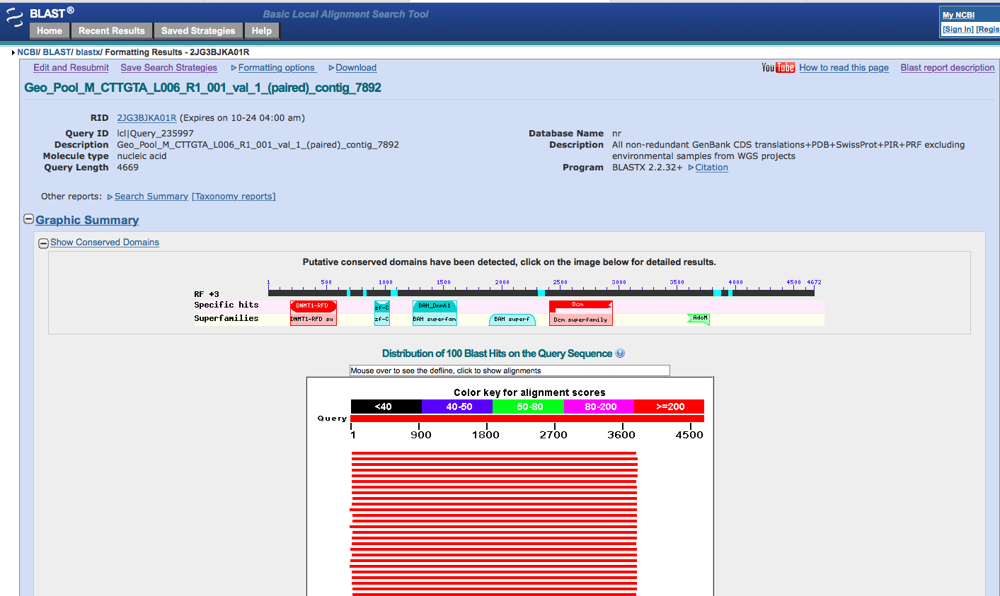

# MY RESEARCH INTEREST
By Rocío Guerrero
___
Mi **investigación** aborda el metabolismo de carbohidratos en el pejelagarto como modelo de peces ancestrales. Esta es una foto de la especie *A. tropicus* 

`foto del pejelagarto` 
---

---
# MAKING BLAST =)
`22/oct/2015`

Hoy aprendí como alinear un gen contra una secuencia de referencia. A continuación lo describo paso a paso.

1.- Primero baje el gen DNMT1 de *Homo sapiens* en formato FASTA

 

2.- La descarga se guardo en mi escritorio, así que moví el archivo con Shell a mi carpeta query que está dentro de la carpeta big-data

 

3.- Abri Jupyter a través de la terminal y cree la notebook homo sapiens. Desde ahí comparé mi gen de interés contra la base de datos de Geo_Male. Debido a que es la secuencia de un gen contra la base de datos de una secuencia genómica utilicé el comando blastn

4.- Tecleando el comando cat llame a todo mi archivo, con ello pude ver los "hits" y seleccione el de menor E-value

5.- Con el comando grep pude ver la secuencia del "hit" de interés

6.- Finalmente fui al NCBI y comparé la secuencia que hizo hit contra la base de datos de proteína con un blastx y encontre los dominios conservados

